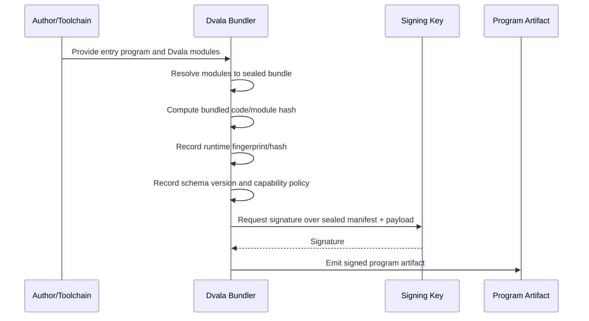
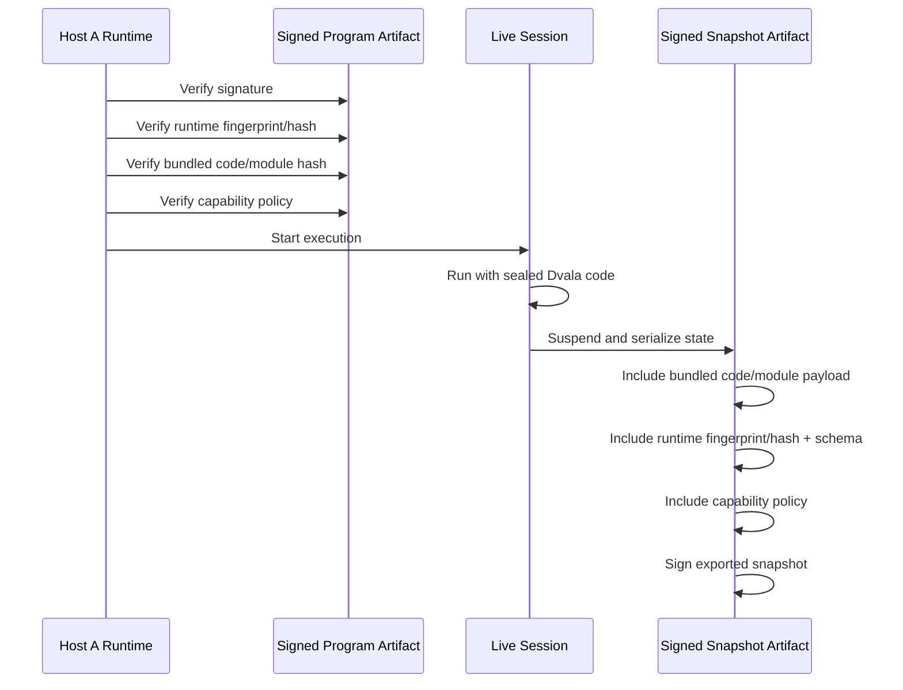
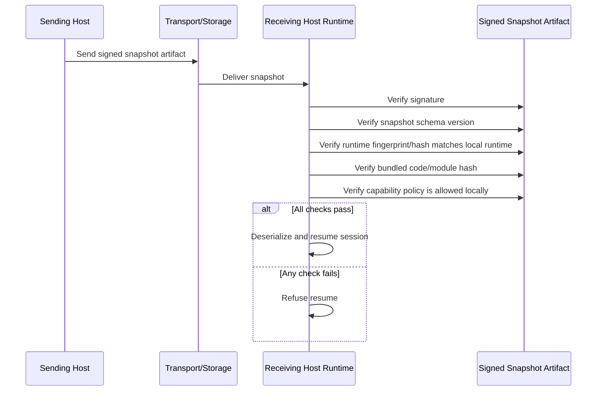

# Dvala Backend Authority

**Status:** Active primary track
**Created:** 2026-05-06

## Status Note

This document is now the primary architectural driver for the next phase of work.

The playground plan in [design/active/2026-04-26_playground-monaco-tree-ls-cli.md](2026-04-26_playground-monaco-tree-ls-cli.md) is intentionally parked after producing the main evidence this document needs. Future playground work should be selected only when it validates a backend seam, a runtime/session contract, or a thin-client integration path described here.

## Goal

Define a long-term architecture where Dvala semantics live behind a single backend authority rather than being reimplemented piecemeal in VS Code, the playground, CLI mode, or any future IDE client.

The target is not merely "a better language server." The target is a Dvala backend that owns parsing, analysis, execution, runtime state, and inspection, with editor integrations reduced to transport and UI layers.

---

## Background

Today the codebase is moving toward a healthier split, but the system still has multiple semantic centers of gravity:

- The language-service surface owns diagnostics, hover, completions, navigation, rename, and formatting.
- The evaluator/runtime owns execution, continuations, handlers, checkpoints, and snapshots.
- The playground and VS Code extension still contain Dvala-aware orchestration logic that is not purely presentational.

That split is workable in the short term, but it creates long-term problems:

- semantic drift between clients
- duplicated caching and workspace-state logic
- separate lifecycle models for "analysis" and "runtime"
- difficulty exposing richer Dvala-specific IDE features without embedding more Dvala logic into each client

The desired end state is closer to "VS Code, but better": the IDE has no privileged builtin access to Dvala semantics. It is just one client of a Dvala backend.

## Problem Statement

If Dvala semantics remain split between editor-side code and runtime-side code, then every new feature risks one of two bad outcomes:

1. The feature is implemented twice, once for analysis and once for runtime.
2. The feature is implemented in one client only, making the backend less canonical over time.

This is especially dangerous for Dvala because the interesting product surface is not only language service. It also includes:

- execution sessions
- suspend/resume state
- snapshots and checkpoints
- effect traces
- REPL state
- runtime inspection
- future debugging and replay

Those capabilities do not fit naturally inside raw LSP requests, but they still need to come from the same semantic source of truth as rename, hover, and completions.

## Proposal

Create a Dvala backend platform with a distinct runtime at its core, a modular workspace backend layered around it, and multiple protocol adapters and clients on top.

### Core idea

The backend platform owns:

- canonical workspace/document state
- import and module resolution
- parser/tokenizer/AST/CST generation
- symbol and type indexing
- diagnostics, hover, completion, navigation, rename, formatting
- execution sessions and REPL state
- continuations, checkpoints, snapshots, and traces

Clients do not embed Dvala semantics. They only:

- open/update/close documents
- request language features
- request execution/debug/inspection features
- render results

### Important boundary

This is not a proposal to force everything through LSP.

It is also not a proposal to make "the backend" one monolithic IDE server.

Instead:

- use LSP where editor-facing language semantics fit naturally
- use DAP or a Dvala-specific RPC layer where execution, replay, snapshots, traces, and runtime state need richer APIs
- make the Dvala Runtime a distinct backend component rather than just one feature inside a workspace host
- make the Dvala Workspace Backend modular and capability-composed rather than a single mandatory product shape
- treat the playground as the broad reference implementation on top of the backend, not as the default shape every application must inherit

The backend platform is the product. LSP is only one protocol adapter.

## Analysis And Reflections

The main refinement from this discussion is that "backend authority" is still too coarse unless the runtime is given first-class status.

The Dvala Runtime is the part most likely to be used directly in the wild. It is the semantically distinctive part of Dvala: evaluation, continuations, effects, sessions, checkpoints, snapshots, and runtime serialization. That means it should be architecturally primary rather than treated as one capability buried inside an IDE-oriented backend. It should be the part KMP implements, and it should be a real subproject in the repo.

The Dvala Workspace Backend then becomes a modular host layered around that runtime. It should own overlays, indexing, document lifecycle, adapters, and workspace-oriented orchestration, but it should not absorb the runtime into an undifferentiated service. The runtime should be depended on by the workspace backend, not the other way around.

This modularization matters because the playground is only one consumer shape. It is a useful reference implementation because it uses nearly every capability, but most applications will want a subset:

- a thin Dvala editor mostly needs overlays, analysis, and LSP-facing capabilities
- auditing tools mostly need parsing, workspace graph, analysis, and perhaps controlled runtime/reporting capabilities
- the playground needs the broadest composition, including editor, runtime sessions, traces, checkpoints, snapshots, and structural inspection

The architectural consequence is that the backend should be decomposed into capability modules and product profiles rather than treated as one required host for every use case.

The playground work also clarified something important: many of the highest-value recent fixes were not really playground features. Worker-owned document state, open-buffer overlay semantics, request correlation, stale-result suppression, and snapshot-oriented flows all behaved like backend-authority problems wearing playground clothes. That is a strong signal that the center of gravity should now move here.

## Design Principles

1. One semantic authority
Only one subsystem should decide what Dvala code means at any given workspace state.

2. Runtime is first-class
The Dvala Runtime is a distinct backend part, usable outside the IDE, and the primary target for KMP implementation.

3. Thin clients
VS Code, the playground, and CLI mode should contain presentation and transport logic, not Dvala semantics.

4. Modular backend composition
The workspace backend should be decomposable into capability modules so different applications can depend on narrower backend slices rather than inheriting the full playground-shaped stack.

5. Shared workspace overlay model
Unsaved open-document content must overlay persisted workspace files consistently across all analysis and runtime requests.

6. Separate analysis from execution lanes
Analysis work must remain responsive and cancellable. Execution work may be long-running, effectful, or suspended. These concerns should share the same backend authority without sharing the same scheduling model.

7. Editor-agnostic Dvala features
If a Dvala feature is worth having, it should be available to any client that can speak the backend protocol, not only to the current IDE.

## Proposed Architecture

## 1. Dvala Runtime

A distinct backend component that contains the semantically real execution engine.

- evaluator/runtime
- continuation and snapshot machinery
- effects and session semantics
- runtime serialization and wire contracts
- runtime-facing module loading semantics

Runtime-facing module loading semantics should be explicit rather than left as an accidental detail of whichever host embeds the runtime.

In particular, the runtime should define how builtin modules are located, versioned, loaded, and identified.

- Builtin modules should be treated as part of the runtime semantic surface, not as editor assets or host-local conveniences.
- If builtin modules are authored as `.dvala` source, the runtime should still load them through a defined runtime module bundle or manifest rather than by relying on ad hoc filesystem lookups.
- The main reason is semantic exactness: a given runtime build should carry the exact builtin module set and contents it was validated with, so evaluation semantics do not drift between playground, VS Code, CLI, browser, Node, or future KMP hosts.
- That argues for builtin modules being part of a Dvala build artifact, or at least part of a versioned runtime-distribution step, instead of being discovered loosely from the surrounding repo or client package.
- User/workspace modules are different: their resolution belongs to the workspace backend overlay model, while builtin-module identity and contents belong to the runtime contract.

This suggests a useful split:

- the runtime owns builtin module manifests, builtin source payloads or compiled equivalents, and the rules for resolving `dvala/...` or other reserved builtin namespaces
- the workspace backend owns project-file overlays, import resolution for user code, and any environment-specific bridge from workspace modules into runtime execution

Whether builtin modules remain stored as `.dvala` source in the repo is a separate implementation choice. The architectural requirement is that runtime builds consume them through a reproducible packaging step that guarantees the same builtin semantics everywhere the runtime runs.

Security should follow the same principle of explicit runtime identity rather than loose compatibility claims.

For any program or snapshot that is meant to be portable, resumable, or shareable across trust boundaries, the artifact should carry and be verified against:

- a hash of the bundled Dvala code and modules
- a hash or fingerprint of the runtime semantic image, not only a version string
- an artifact/schema version
- any declared capability policy
- a signature from a trusted producer

The reasoning is straightforward:

- a version string is metadata, but a hash is identity
- a signature transfers trust, while a hash alone only detects byte changes
- snapshots are especially sensitive because they carry suspended execution state, not just source
- if module code is baked into the snapshot or program artifact, the runtime can stay small while still resuming exactly the code that was sealed and signed

The default policy should therefore be explicit:

- programs and snapshots intended for normal use should be signed
- the runtime should verify the signature before execution or resume
- the runtime should verify the required runtime fingerprint/hash, not merely an approximate compatible version
- the runtime should verify the bundled code/module hash so the exact sealed Dvala code is what gets executed
- unsigned artifacts may exist in explicit development mode, but they should be treated as a deliberate local escape hatch rather than the default trust model

This keeps the trust contract tight: the artifact says exactly which runtime identity, which Dvala code, and which policy it expects, and the runtime either proves that match or refuses to run.

### Security Flow

The diagrams below show the intended secure lifecycle from bundling and signing through execution, suspension, transfer, and resume.

This is the part expected to be used directly outside IDE clients. It should be a real subproject in the repo, for example `dvala-runtime`, and it is the natural target for KMP implementation.

It should not own:

- Monaco or VS Code concepts
- LSP request shapes
- editor document lifecycle
- workspace file watching
- UI panel/view concerns

## 2. Dvala Core Tooling

A UI-free and editor-free semantic/tooling layer that contains:

- tokenizer
- parser
- AST/CST/source maps
- formatter
- workspace index / symbol graph / type graph
- module registry and import resolution primitives

This layer should remain UI-free and editor-free.

## 3. Dvala Workspace Backend

A long-lived backend host that owns canonical workspace state and composes runtime and analysis capabilities.

Responsibilities:

- track open documents and versions
- maintain persisted-file plus open-buffer overlays
- incrementally build and cache analysis state
- host and route runtime sessions through the runtime component
- manage execution sandboxes
- expose cancellation and request correlation
- publish diagnostics and other invalidations

This backend may run:

- as a Node process for local development / VS Code
- as a web worker for the browser playground
- eventually as a portable host around the KMP runtime where appropriate

This should also be modularized into capability modules rather than shipped as one indivisible server.

## 4. Backend Capability Modules

Indicative modules:

- document overlay module
- parser / AST / CST module
- analysis module
- runtime session host module
- snapshot / checkpoint module
- trace / inspection module
- LSP adapter module
- debug adapter module
- filesystem / workspace module

These are not product shapes by themselves. They are backend capabilities that can be composed into different clients and deployment profiles.

## 5. Protocol Adapters

### LSP adapter

Use for:

- diagnostics
- hover
- completion
- definition / references / rename
- formatting
- semantic tokens / inlay hints / code actions / outline

### Debug adapter or custom debug RPC

Use for:

- stepping
- breakpoints
- stack frames
- suspended continuation inspection
- runtime variable views

### Dvala runtime RPC

Use for:

- run / runAsync / REPL
- session lifecycle
- checkpoint listing
- snapshot loading / replay
- effect trace streaming
- doc-tree / AST / CST / type inspection panels
- richer runtime views that do not fit LSP/DAP well

## 6. Product Profiles

### Playground profile

The playground should be treated as the broad reference implementation on top of the backend platform. It is likely to use the widest set of backend capabilities, including editor semantics, runtime sessions, traces, snapshots, and structural inspection surfaces.

### Thin editor profile

Likely capabilities:

- document overlays
- analysis
- LSP adapter
- formatting and standard IDE affordances

Likely exclusions:

- runtime sessions
- checkpoints/snapshots
- rich trace/replay surfaces

### Auditing tools profile

Likely capabilities:

- parser / AST / CST
- workspace graph
- symbol/type analysis
- reporting / export flows
- possibly controlled runtime inspection or batch execution

Likely exclusions:

- interactive editor affordances
- IDE-specific transport and presentation concerns

## 7. Thin Clients

Clients become mostly:

- transport
- state synchronization
- view rendering
- command routing

The current major clients are:

- VS Code extension
- playground web app
- CLI local mode

The playground is the broad reference composition, not the mandatory default shape for all applications.

## Protocol Split

### What should stay in LSP

- anything whose primary consumer is the text editor surface
- request/response features on a document position or range
- standard IDE affordances expected by generic editors

### What should not be forced into LSP

- run sessions
- REPL evaluation
- continuation serialization and restore
- checkpoint/snapshot browsing
- effect timelines
- runtime inspection panels
- replay controls
- workflow/session state

These need explicit Dvala backend RPCs.

## Process Model

### Analysis lane

- aggressively cancellable
- optimized for latency
- read-mostly over workspace/document overlays
- safe to restart without losing user runtime state

### Execution lane

- stateful and session-oriented
- may suspend and resume
- may run long or require sandboxing / limits
- may produce streamed outputs and traces

Both lanes should share the same canonical workspace overlay model and core semantics, but they should not compete inside one undifferentiated event loop.

The runtime should therefore be distinct without forcing the workspace backend to become runtime-agnostic. The backend composes the runtime; it should not dissolve it.

## Migration Strategy

## Lessons Carried Forward

The parked playground track produced several concrete constraints for this backend plan:

1. Canonical state ownership is non-negotiable.
Mixed ownership between worker, main thread, runtime host, and UI surfaces creates stale-state and sequencing bugs quickly. The backend must be the single authority for overlays, request correlation, and invalidation.

2. Open-buffer overlays belong below the client boundary.
Unsaved state from one open file has to affect rename, completion, navigation, diagnostics, and runtime-facing flows in other files. That is backend behavior, not editor glue.

3. Worker protocol rules foreshadow backend protocol rules.
Correlation IDs, resync on mirror mismatch, cancellation, and recovery after worker restart are not incidental implementation details. They are early forms of the backend contract and should survive the move from playground worker to broader backend platform.

4. Snapshot and session features raise the architectural stakes.
Once suspend/resume and serialized runtime state are involved, the system needs explicit runtime identity, artifact policy, and verification rules. That pressure does not belong inside a playground-specific implementation.

5. The playground should remain broad, but derivative.
It is still the best reference implementation because it exercises a wide slice of the platform. But it should validate backend design, not define it.

## Immediate Execution Focus

The next work should optimize for backend leverage rather than playground feature completion.

In order:

1. Make the runtime boundary concrete.
Name the smallest stable responsibilities of `dvala-runtime`: evaluator semantics, continuation model, effect machinery, serialization contracts, artifact verification, builtin-module identity, and runtime fingerprint reporting.

2. Sketch the first backend API.
Define an editor-agnostic API surface for document overlays, analysis requests, session lifecycle, snapshot loading/resume, and inspection queries.

3. Define package and dependency directions.
Make the intended repository structure explicit: `dvala-runtime`, `dvala-core-tooling`, `dvala-workspace-backend`, and adapter/client layers, with one-way dependency rules.

4. Choose one validation slice.
Pick one concrete flow where the playground or another client becomes a thin consumer of a backend-shaped seam, ideally around runtime/session or snapshot behavior rather than another pure LS feature.

## Phase A: Finish making the LS worker the canonical owner of analysis-side document state

This work produced the architectural evidence it needed and is no longer the primary driver. Treat any remaining worker-hardening tasks as validation work only when they directly inform the backend boundary.

The main backend takeaway from that track is:

- all LS-backed features consume the same canonical snapshot model
- all request sequencing, cancellation, and stale-result handling are uniform
- no client-owned semantic caches remain for LS features

## Phase B: Introduce an explicit backend service boundary

Define a Dvala backend interface independent of Monaco and VS Code.

The first version can still live in-process or in-worker, but the API should stop being editor-shaped and start being backend-shaped.

Example capabilities:

- `openDocument`, `updateDocument`, `closeDocument`
- `requestAnalysis(feature, request)`
- `startSession`, `runSnippet`, `resumeSnapshot`, `stopSession`
- `inspectAst`, `inspectTypes`, `inspectTrace`

At the same time, separate the runtime boundary from the workspace backend boundary so the runtime can become a stable, independently consumable component.

## Phase C: Move playground runtime orchestration behind the same backend authority

The playground should stop directly owning Dvala runtime semantics and instead become a frontend for backend sessions and inspection surfaces.

This is the point where "LS" evolves into a broader workspace backend, with the playground acting as the fullest reference composition on top of it.

## Phase D: Make the VS Code extension a thin client of the backend

The extension should ideally become:

- transport bootstrap
- registration of editor capabilities
- rendering of custom panels/views

with minimal embedded semantic logic.

## Phase E: Unify local CLI mode and IDE mode around the same backend

Instead of separate editor and runtime code paths, CLI-backed local mode should talk to the same backend authority and file-overlay model.

## Phase F: Carve out runtime and backend subprojects

Create explicit repository boundaries such as:

- `dvala-runtime`
- `dvala-workspace-backend`
- optionally separate protocol adapter packages if that becomes useful

This makes the architectural distinction visible in code rather than only in design prose.

## Benefits

- consistent semantics across playground, VS Code, and CLI
- one source of truth for workspace overlays and caches
- a distinct runtime that can be embedded and used outside IDE workflows
- clearer path for KMP to implement the runtime rather than editor/server glue
- modular backend compositions for thin editors, auditing tools, and richer clients
- easier addition of Dvala-specific IDE features
- stronger separation between UI and language/runtime logic
- fewer client-specific bugs around stale state and workspace divergence
- better path toward portable backend implementations later

## Risks

- the backend could become an oversized monolith if analysis and execution are not separated internally
- the workspace backend could still collapse into a playground-shaped default if capability boundaries are not kept strict
- overusing LSP could distort runtime feature design
- protocol design may freeze the wrong abstractions too early
- browser-mode constraints may tempt client-side shortcuts that reintroduce split semantics

## Non-Goals

- replacing every existing protocol with one new custom protocol immediately
- removing LSP support
- merging analysis and execution into one single-threaded loop
- solving KMP runtime portability in the same project phase

## Open Questions

- Should the backend authority be one process with multiple lanes, or multiple cooperating processes behind one facade?
- Which capabilities belong in the runtime versus the workspace backend, and which should stay in shared tooling layers?
- How much of the runtime inspection surface should map to DAP versus Dvala-specific RPC?
- What is the minimal backend API worth stabilizing first so clients can start converging without a big-bang migration?
- In browser mode, should the same facade hide one worker or multiple workers?
- Which current playground concerns should be the first to move fully behind the backend boundary after LS parity work finishes?

## Implementation Plan

1. Define the runtime boundary explicitly and scope a `dvala-runtime` subproject as the first-class portable engine target.
2. Write a concrete backend API sketch that is editor-agnostic and separates runtime, analysis, execution, inspection, and artifact-verification capabilities.
3. Define package boundaries and dependency directions for `dvala-runtime`, `dvala-core-tooling`, `dvala-workspace-backend`, and protocol adapters.
4. Define backend capability modules and product profiles, including playground, thin editor, and auditing-tool compositions.
5. Map current playground and VS Code responsibilities onto that API to identify which client-owned semantics still need extraction.
6. Move one runtime-facing client surface behind the backend boundary, preferably a session, snapshot, or inspection-oriented feature rather than another pure LS request.
7. Introduce a transport adapter layer so Monaco/VS Code registration code depends on backend capabilities rather than direct Dvala internals.
8. Revisit whether any remaining playground worker-hardening work is still needed as backend validation, and stop if it no longer answers an architectural question.
9. Revisit process topology for browser, local CLI, and VS Code modes once the backend API is stable enough to measure.