# Trampoline Evaluator Architecture

The Dvala evaluator is a trampoline-style state machine. Instead of recursive evaluation (which consumes the JS call stack), every evaluation step returns a data structure describing "what to do next." A central loop processes these steps until the program completes.

This design enables: suspension/resume, continuation serialization, algebraic effects, tail-call elimination, and parallel/race execution — all without growing the host call stack.

## Core Concept

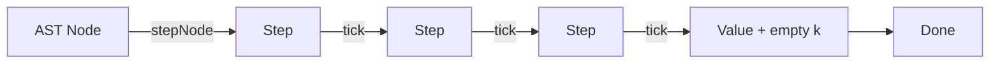

The evaluator has three core functions:
- **`stepNode(node, env, k)`** — Maps an AST node to the next Step (always synchronous)
- **`applyFrame(frame, value, k)`** — Processes a completed sub-result against a frame (may return Promise)
- **`tick(step)`** — Processes one step and returns the next step

The trampoline loop calls `tick()` repeatedly until it gets a `Value` step with an empty continuation stack.

## Step Types

Steps are the "instructions" that flow through the trampoline:

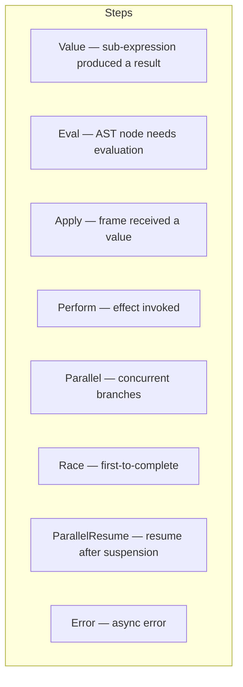

| Step | Purpose | Next action |
|------|---------|-------------|
| **Value** | Sub-expression produced a value | Pop frame from `k`, apply it. If `k` empty → program done. |
| **Eval** | AST node needs evaluation | Call `stepNode(node, env, k)` |
| **Apply** | Frame received a value | Call `applyFrame(frame, value, k)` |
| **Perform** | `perform(eff, arg)` invoked | Search `k` for handler, dispatch |
| **Parallel** | `parallel(...)` encountered | Run branches concurrently |
| **Race** | `race(...)` encountered | First branch to complete wins |
| **ParallelResume** | Resuming parallel after suspension | Resume remaining branches |
| **Error** | Async operation failed | Route to `dvala.error` handler |

## The Main Loop

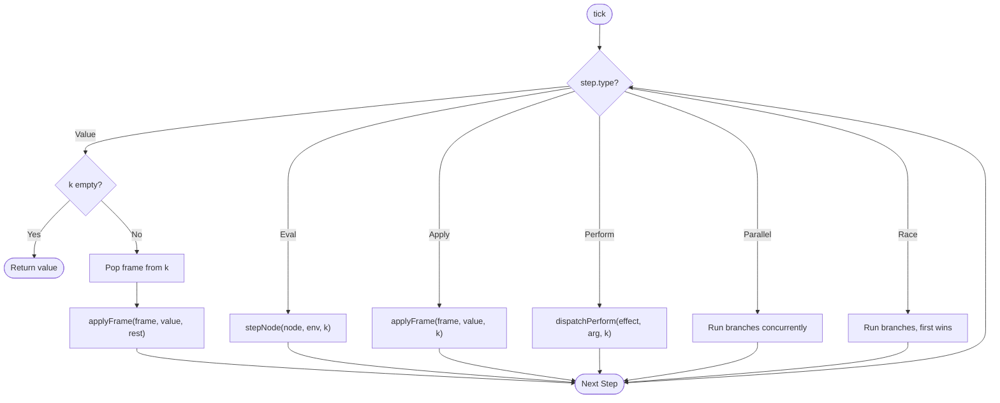

The sync trampoline (`runSyncTrampoline`) runs this loop directly. The async trampoline (`runAsyncTrampoline`) awaits when a step returns a Promise.

## The Continuation Stack (`k`)

The continuation stack is an array of frames representing "what to do after the current expression completes."

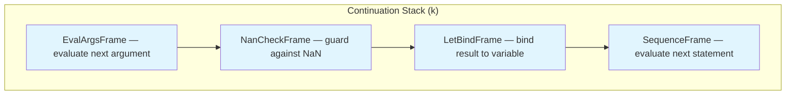

- **Top of stack** is at index 0 (innermost pending work)
- When a `Value` arrives, the top frame is popped and applied
- Frames are plain data objects — no closures — enabling serialization

## Frame Categories

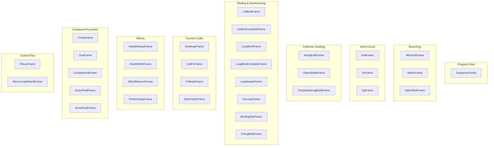

There are 43 frame types total. Each is a plain object with a `type` discriminator and an `env` reference.

## How `stepNode` Routes by Node Type

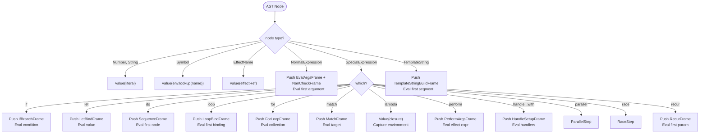

Leaf nodes (Number, String, Symbol) produce a `Value` immediately. Compound nodes push one or more frames onto `k` and return an `Eval` for the first sub-expression.

## Function Call Flow

A function call like `+(1, 2)` or `map(f, arr)` follows this sequence:

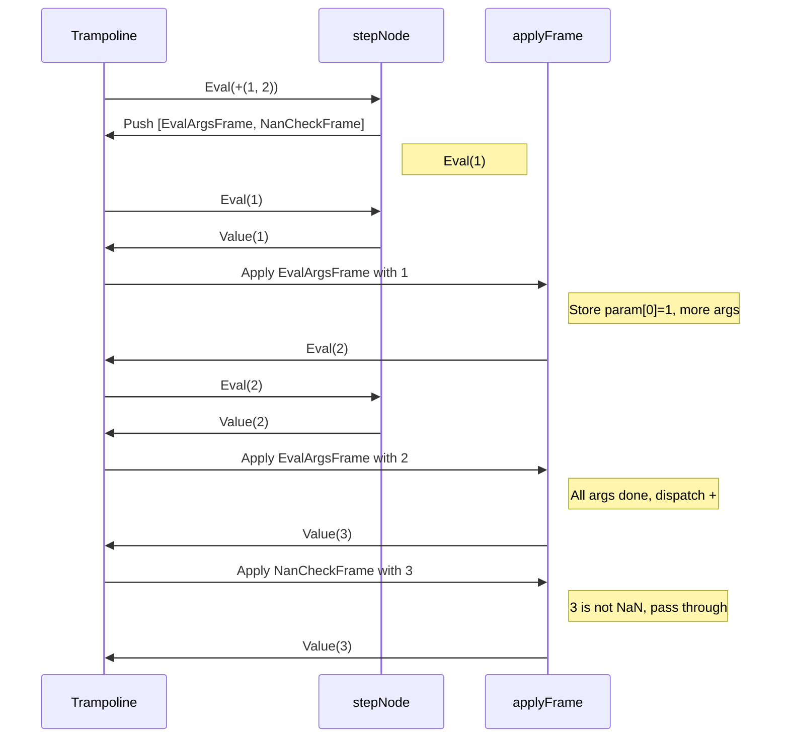

### User-Defined Function Calls

For user-defined functions, after arguments are collected:

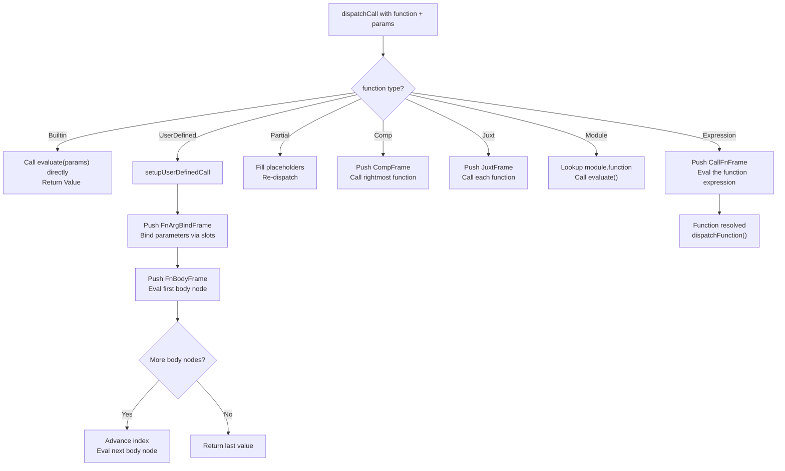

### Tail-Call Elimination (recur)

`recur` does not grow the stack — it rebinds and re-enters:

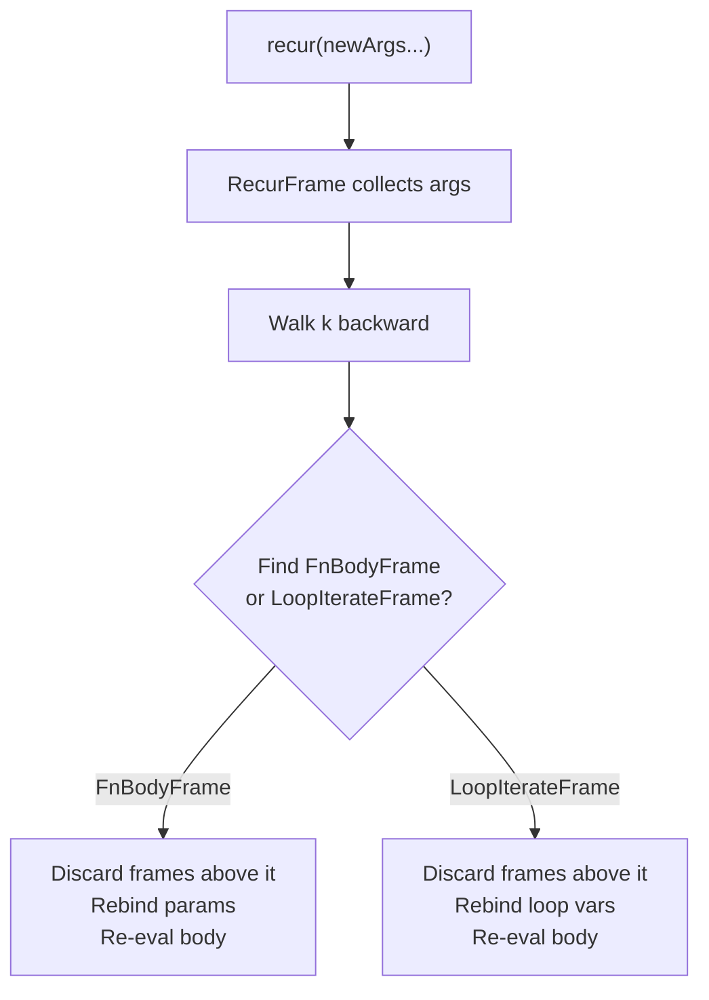

## Effect Dispatch Flow

When `perform(effect, arg)` is evaluated:

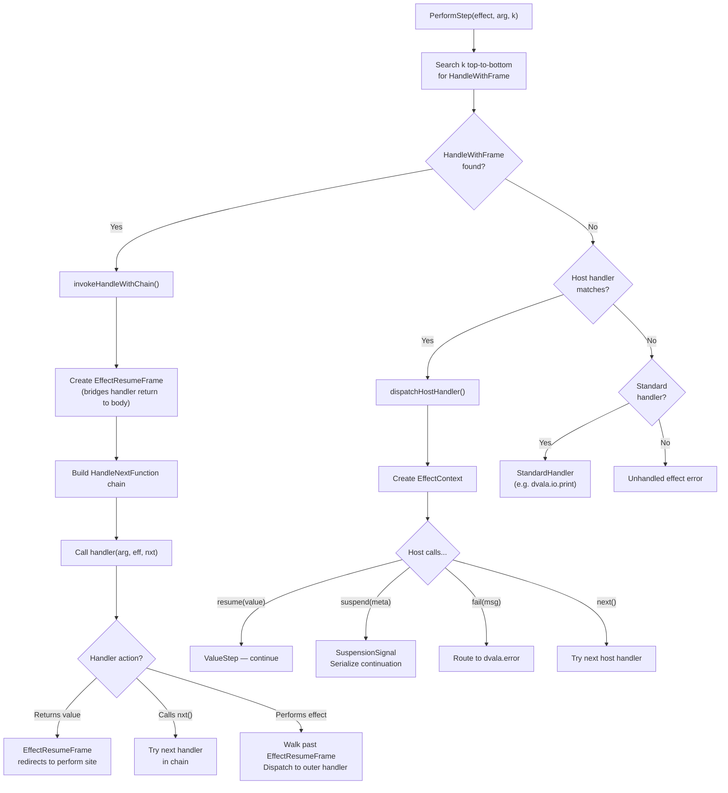

### Handler Search Priority

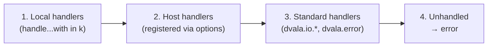

## Parallel Execution

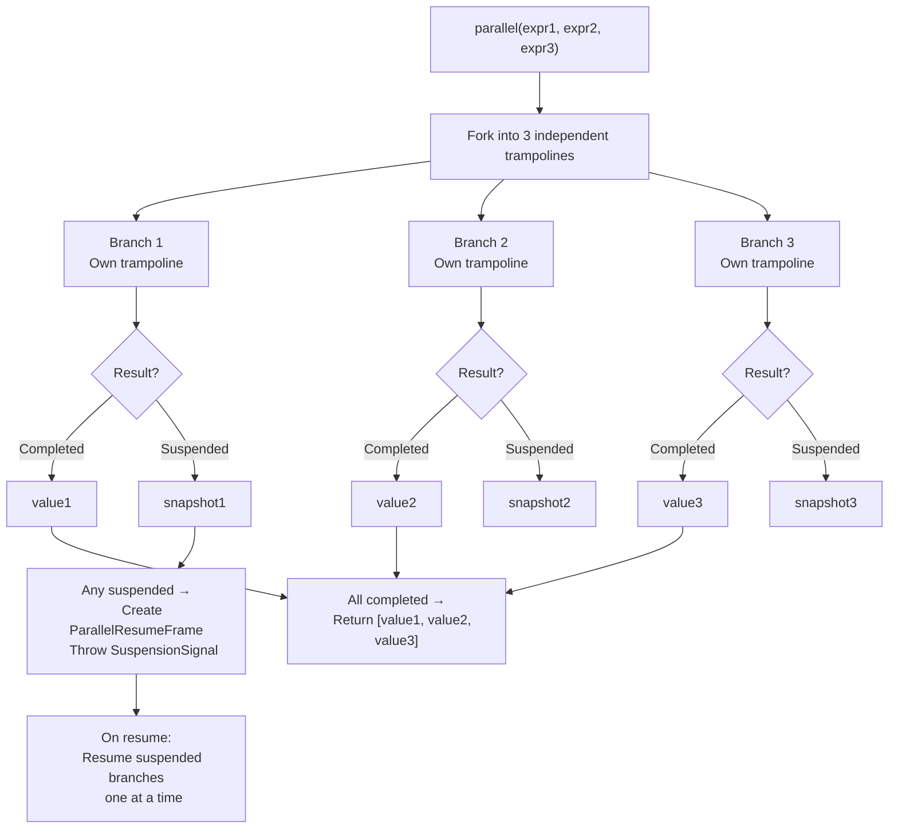

All branches run concurrently via `Promise.allSettled`. If any branch suspends, the entire parallel suspends. On resume, suspended branches are resumed sequentially.

## Race Execution

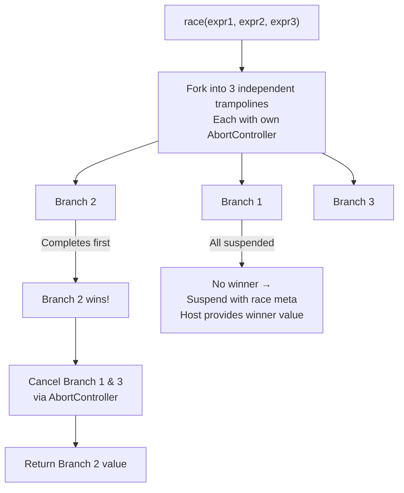

Difference from parallel: race returns a single winner value, not an array. Losing branches are cancelled.

## Evaluation Example: `let x = 1 + 2; x * 3`

```mermaid
sequenceDiagram
    participant L as Loop
    participant SN as stepNode
    participant AF as applyFrame

    Note over L: Start: Eval(do let x=1+2; x*3 end)

    L->>SN: stepNode(do...end)
    SN-->>L: Push SequenceFrame(nodes=[let x=1+2, x*3], idx=0)
    Note right of SN: Eval(let x = 1+2)

    L->>SN: stepNode(let x = 1+2)
    SN-->>L: Push LetBindFrame(target=x)
    Note right of SN: Eval(+(1, 2))

    L->>SN: stepNode(+(1, 2))
    SN-->>L: Push EvalArgsFrame + NanCheckFrame
    Note right of SN: Eval(1)

    L->>SN: stepNode(1)
    SN-->>L: Value(1)

    L->>AF: EvalArgsFrame + value=1
    AF-->>L: Store param[0]=1, Eval(2)

    L->>SN: stepNode(2)
    SN-->>L: Value(2)

    L->>AF: EvalArgsFrame + value=2
    Note right of AF: All args done, dispatch +
    AF-->>L: Value(3)

    L->>AF: NanCheckFrame + value=3
    AF-->>L: Value(3) — pass through

    L->>AF: LetBindFrame + value=3
    Note right of AF: Bind x=3, create new scope
    AF-->>L: Eval(x*3) in env{x:3}

    L->>AF: SequenceFrame + advance index
    Note right of AF: idx=1, Eval(x*3)

    L->>SN: stepNode(*(x, 3))
    SN-->>L: Push EvalArgsFrame + NanCheckFrame
    Note right of SN: Eval(x)

    L->>SN: stepNode(x)
    SN-->>L: Value(3) — from env lookup

    L->>AF: EvalArgsFrame + value=3
    AF-->>L: Eval(3)

    L->>SN: stepNode(3)
    SN-->>L: Value(3)

    L->>AF: EvalArgsFrame + value=3
    Note right of AF: All args done, dispatch *
    AF-->>L: Value(9)

    L->>AF: NanCheckFrame + value=9
    AF-->>L: Value(9)

    L->>AF: SequenceFrame — last node
    AF-->>L: Value(9)

    Note over L: k is empty → return 9
```

## Environment Model

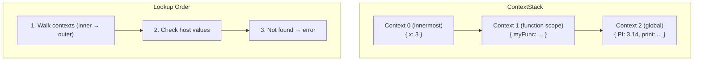

- `env.create(context)` pushes a new scope (for let, function args, etc.)
- All contexts are plain `Record<string, {value: Any}>` — serializable
- The global context accumulates top-level bindings

## Key Invariants

1. **`stepNode` is always synchronous** — never returns a Promise
2. **`applyFrame` may return a Promise** — when builtins are async
3. **No closures on frames** — all state is plain data (enables serialization)
4. **Frames store environments by reference** — ContextStack is mutable within a scope
5. **Tail-call elimination** — `recur` rebinds and re-enters without growing `k`
6. **Effect handlers form a chain** — each handler's `nxt` passes control to the next

## Suspension & Serialization

At any point, the entire execution state is capturable:

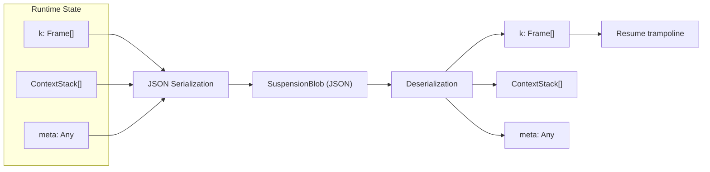

This works because:
- All frames are plain objects (no closures)
- ContextStacks are serialized with `__csRef` markers for circular references
- The trampoline loop doesn't use the JS call stack — there's nothing hidden to capture
